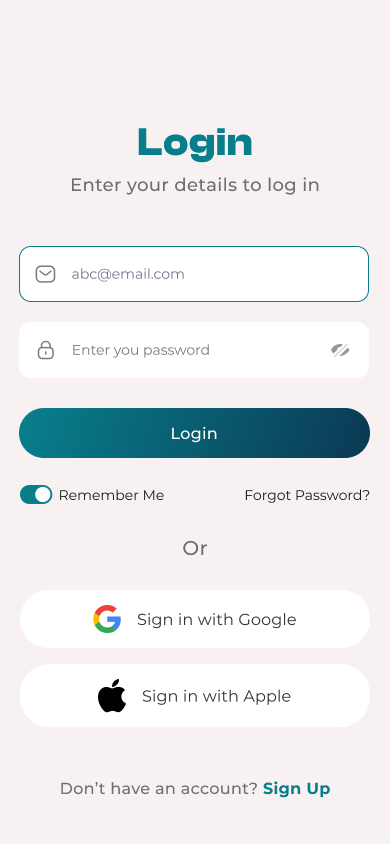

# 📚 Salford – Online Learning App
## تطبيق تعليمي (Educational App)

تطبيق تعليمي متكامل مبني باستخدام **React Native** يهدف إلى توفير تجربة تعليمية سهلة وعصرية للطلاب والمعلمين، مع دعم كامل للغات ونظام اشتراكات متقدم.

---

## 🎯 وصف المشروع
هذا المشروع عبارة عن تطبيق تعليمي يتيح للمستخدمين تصفح الدورات التعليمية، مشاهدة المحتوى، وإدارة حساباتهم الشخصية، مع دعم نظام تسجيل الدخول والدفع والاشتراكات.

---

## ✨ المميزات
- 🔐 نظام مصادقة كامل (تسجيل دخول / إنشاء حساب)
- 📚 تصفح الدورات التعليمية
- 🔍 البحث في الدورات
- 📖 مشغل الدورات التعليمية
- 💳 نظام الاشتراكات والدفع
- 👤 صفحة الملف الشخصي
- 🌐 دعم اللغتين العربية والإنجليزية
- 🎨 واجهة مستخدم عصرية وجذابة
- ⚡ أداء سريع وتجربة مستخدم سلسة

---

## 📱 لقطات الشاشة (Screenshots)

<p float="left">
  
  
  
  
  
  
  
  
  
  
  
  
  
  
  
  
  
  
</p>

---

## 🛠️ التقنيات المستخدمة
- React Native
- TypeScript
- Redux Toolkit
- React Navigation
- Axios
- AsyncStorage
- i18n (لدعم تعدد اللغات)
- Android SDK
- iOS SDK

---

## ⚙️ التثبيت والتشغيل

### 📋 المتطلبات
- Node.js
- React Native CLI
- Android Studio (لتطوير Android)
- Xcode (لتطوير iOS – macOS فقط)

---

### 📥 خطوات التثبيت
استنساخ المشروع:
```bash
git clone https://github.com/yamen-almhameed/Online-learning-app-UI-kit-Learning-App.git
cd Online-learning-app-UI-kit-Learning-App